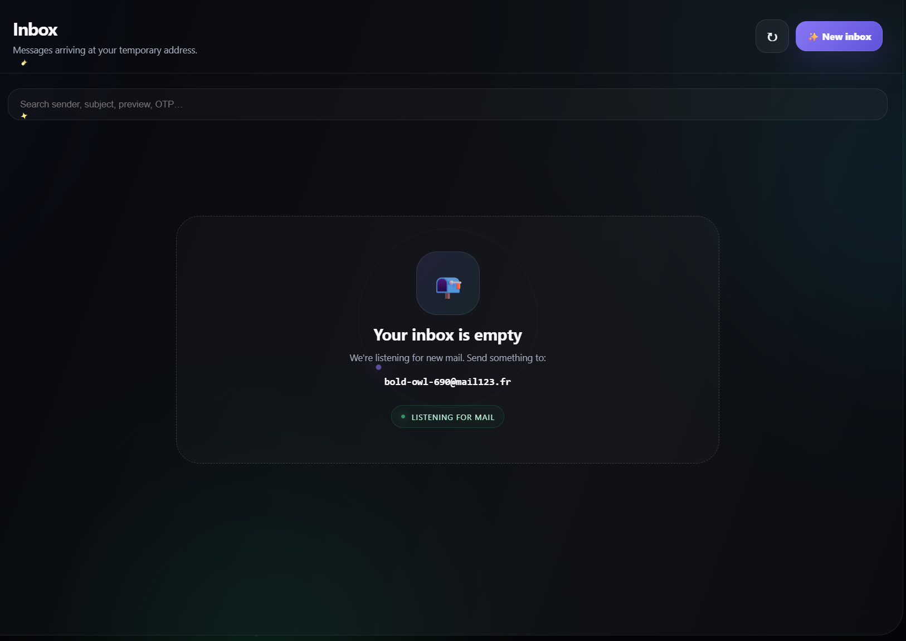

<div align="center">

# ✉️ DropMail

### **Beautiful temporary email. Zero clutter.**

<p>
  <strong>Generate.</strong>
  <strong>Receive.</strong>
  <strong>Read.</strong>
  <strong>Disappear.</strong>
</p>

<br>

<a href="https://github.com/TemporaryEmailFree/Temp">
  
</a>
<a href="https://github.com/TemporaryEmailFree/Temp">
  
</a>


<br><br>


</div>

---

## 🌌 What is DropMail?

**DropMail** is a lightweight disposable email client built entirely for the browser.

It creates a temporary mailbox, watches for incoming mail, and gives you a polished interface for reading messages — all without requiring a traditional account.

Instead of looking like an ancient utility page from 2009, DropMail is designed to feel like a **real modern application**.

> **Temporary email doesn't have to look temporary.** ✨

---

## 🖼️ Preview

<div align="center">

### Main Inbox



<br><br>

### Reading an Email


<br><br>

### Mobile


</div>

> 📸 Add your screenshots to `assets/screenshots/` using the filenames above.

---

# ✨ Features

<table>
<tr>
<td width="50%">

### 📬 Temporary Inbox

Generate a fresh disposable email address with a single click.

No account creation flow.
No unnecessary setup.

</td>

<td width="50%">

### ⚡ Automatic Updates

The inbox automatically checks for incoming messages using adaptive polling.

No constant manual refreshing.

</td>
</tr>

<tr>
<td width="50%">

### 📖 Message Reader

Open an email and view:

* **Sender**
* **Subject**
* **Message body**
* **Timestamp**
* **Verification codes**
* **Attachments**

</td>

<td width="50%">

### 🔎 Instant Search

Search through your inbox by:

* **Sender**
* **Subject**
* **Preview**
* **Message contents**
* **OTP codes**

</td>
</tr>

<tr>
<td width="50%">

### 📋 One-Click Copy

Copy the temporary address instantly with the clipboard button.

</td>

<td width="50%">

### 🎨 Animated Interface

The UI includes:

* Glassmorphism
* Floating particles
* Glow effects
* Animated orbs
* Loading skeletons
* Message entrance animations
* Mail arrival effects

</td>
</tr>

</table>

---

# 🧊 Designed Like a Real App

DropMail uses a **dark glassmorphism interface** built around subtle transparency, glowing accents, and motion.

<div align="center">


</div>

### 🎨 Visual language

| Element           | Purpose                   |
| ----------------- | ------------------------- |
| 🟣 **Purple**     | Primary interactions      |
| 🔵 **Cyan**       | Mail/status information   |
| 🟢 **Green**      | Online/success states     |
| 🔴 **Red**        | Errors and warnings       |
| 🌑 **Dark glass** | Main application surfaces |

The interface intentionally avoids harsh flat panels in favor of **layered translucent surfaces**.

---

# 📮 How It Works

```text
                    ┌──────────────────┐
                    │      USER        │
                    └────────┬─────────┘
                             │
                             ▼
                ┌─────────────────────────┐
                │       DropMail UI       │
                │                         │
                │  Generate / Search /    │
                │  Read / Refresh         │
                └───────────┬─────────────┘
                            │
                            │ API request
                            ▼
                ┌─────────────────────────┐
                │       Mail123 API       │
                │                         │
                │  Temporary mailbox      │
                │  Message retrieval      │
                └───────────┬─────────────┘
                            │
                            │ incoming email
                            ▼
                ┌─────────────────────────┐
                │      DropMail Inbox     │
                │                         │
                │  ✉ Sender               │
                │  ✉ Subject              │
                │  ✉ Preview              │
                └─────────────────────────┘
```

---

# ⚡ Message Flow

```text
CREATE
   │
   ▼
Temporary Address
   │
   ▼
Incoming Email
   │
   ▼
API Check
   │
   ▼
Normalize Message
   │
   ▼
Render Inbox
   │
   ▼
Open Message
   │
   ▼
Read
```

The frontend retrieves messages and normalizes provider data into a consistent structure before rendering it.

---

# 🔄 Adaptive Polling

DropMail avoids endlessly hammering the API.

Instead, it starts with fast checks while the user is actively waiting and gradually backs off.

```text
Immediately
     │
     ▼
   5 sec
     │
     ▼
  10 sec
     │
     ▼
  20 sec
     │
     ▼
  35 sec
     │
     ▼
  55 sec
     │
     ▼
 Longer interval
```

This makes the inbox **feel responsive** without continuously sending requests when nothing is happening.

---

# 📨 Message Interface

A message card contains useful information at a glance:

```text
┌───────────────────────────────────────────────────────┐
│  ✉   sender@example.com                     2:41 PM  │
│                                                       │
│      Your verification code                           │
│      Your code is ready. Click to continue...         │
│                                                       │
│                                           ●  OTP      │
└───────────────────────────────────────────────────────┘
```

Unread messages receive a glowing visual indicator so new mail is immediately noticeable.

---

# 🔐 Temporary Email Use Cases

DropMail is useful for things like:

<div align="center">

| 🧪 Testing   | 📨 Verification     | 📰 Newsletters       |
| ------------ | ------------------- | -------------------- |
| Development  | Temporary sign-ups  | Mailing-list testing |
| QA workflows | Disposable accounts | Inbox experiments    |

</div>

> ⚠️ **Temporary email should not be used for sensitive or important communications.**

---

# 🧩 Tech Stack

<div align="center">


</div>

| Technology             | Role                       |
| ---------------------- | -------------------------- |
| **HTML5**              | Application structure      |
| **CSS3**               | Interface + animations     |
| **Vanilla JavaScript** | Application logic          |
| **Fetch API**          | API communication          |
| **LocalStorage**       | Remember active mailbox    |
| **Canvas API**         | Background particle system |
| **Mail123 API**        | Temporary email backend    |

No framework.

No bundler.

No giant dependency tree.

Just a browser and a single main HTML file.

---

# 📁 Project Structure

```text
DropMail/
│
├── index.html
│
├── README.md
│
└── assets/
    │
    └── screenshots/
        ├── inbox.png
        ├── message.png
        └── mobile.png
```

The current application is intentionally compact, with the UI, CSS, animations, and JavaScript living inside `index.html`.

---

# 🚀 Run Locally

### 1. Clone the repository

```bash
git clone https://github.com/your-username/dropmail.git
cd dropmail
```

### 2. Start a local server

```bash
python -m http.server 8000
```

### 3. Open DropMail

```text
http://localhost:8000
```

And you're in. ✨

---

# 🧪 Debugging

DropMail logs useful API information to the browser console.

Open:

```text
DevTools → Console
```

You may see messages like:

```text
🌐 DROPMAIL REQUEST
📡 RESPONSE
📮 CREATED MAILBOX
📬 CHECKING INBOX
📨 MESSAGE DATA
📖 FULL MESSAGE DATA
```

This makes API and mailbox problems significantly easier to diagnose.

---

# 🌐 API

DropMail currently uses the **Mail123 API** for mailbox creation and message retrieval.

### Create mailbox

```http
GET /api/v1/mailbox/new
```

### List messages

```http
GET /api/v1/mailbox/{address}/messages
```

### Open a message

```http
GET /api/v1/mailbox/{address}/messages/{id}
```

The frontend transforms the API response into DropMail's internal message format before rendering it.

---

# 📱 Responsive

DropMail is designed to gracefully move between desktop and mobile layouts.

### Desktop

```text
┌──────────────┬──────────────────────────────┐
│              │                              │
│   SIDEBAR    │           INBOX              │
│              │                              │
│              │                              │
└──────────────┴──────────────────────────────┘
```

### Mobile

```text
┌──────────────────────────┐
│       DROPMAIL           │
├──────────────────────────┤
│      TEMP MAILBOX        │
├──────────────────────────┤
│         INBOX            │
│                          │
│       MESSAGE            │
│                          │
└──────────────────────────┘
```

---

# 🛣️ Roadmap

### Planned ideas

```text
[ ] Rich HTML email rendering
[ ] Better attachment handling
[ ] Inbox expiration countdown
[ ] Multiple saved inboxes
[ ] Keyboard shortcuts
[ ] PWA support
[ ] Theme customization
[ ] More mailbox providers
[ ] Dedicated backend/proxy
```

The goal is to keep DropMail **fast, simple, and beautiful** rather than turning it into an unnecessarily complicated mail platform.

---

# 🤝 Contributing

Pull requests, bug fixes, ideas, and UI improvements are welcome.

A typical workflow:

```bash
git checkout -b feature/my-feature
```

Make your changes, test the inbox, and open a pull request.

Please keep the project lightweight and avoid adding large dependencies without a good reason.

---

# 💜 Credits

Temporary mail delivery is powered by **Mail123**.

DropMail itself is built with:

**HTML • CSS • JavaScript • Coffee • Way too much debugging**

---

<div align="center">

## ✉️ DropMail

### **Temporary email, upgraded.**

<br>


### ⭐ Star the repository if you like it.

</div>
